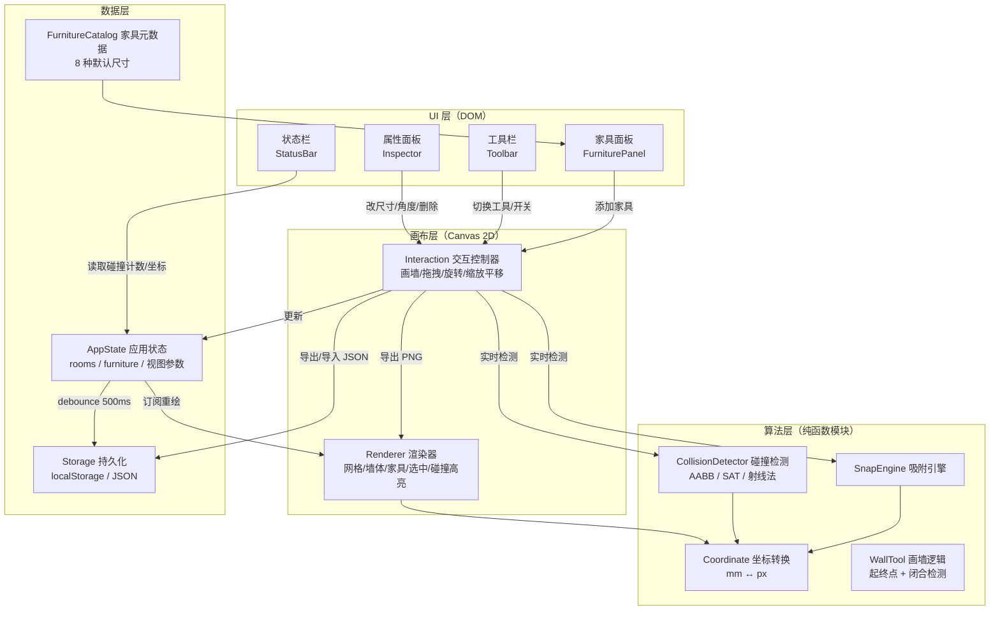
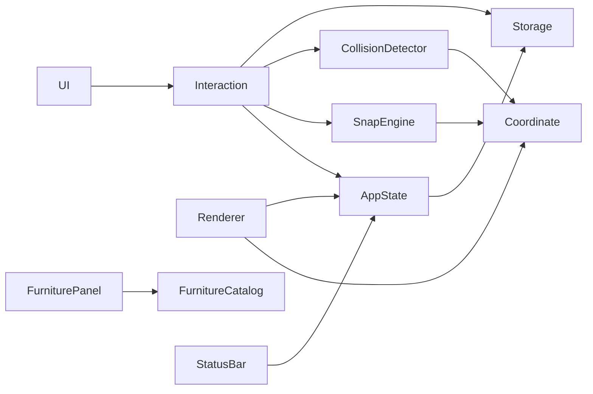
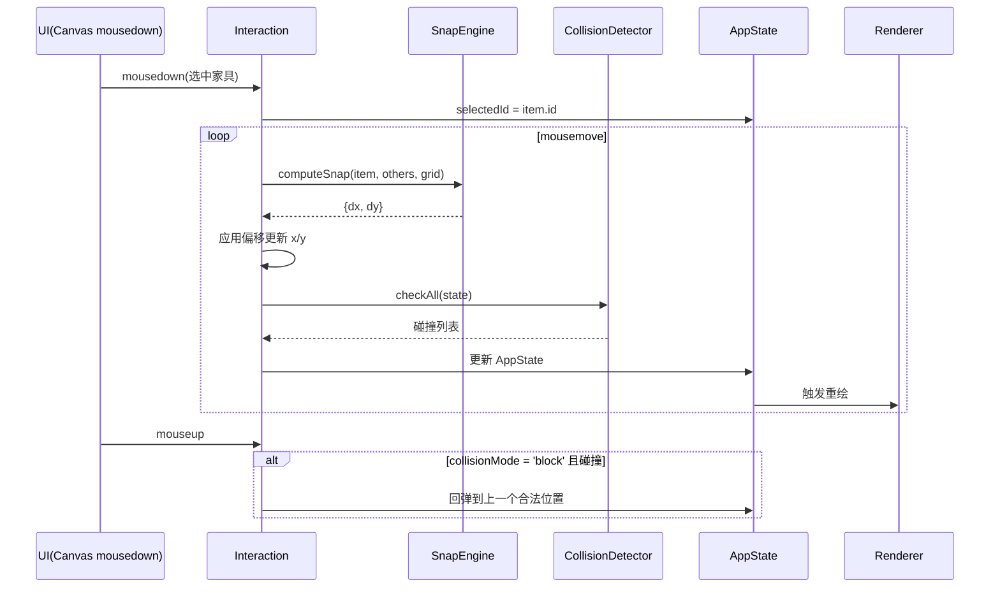

# CODE WIKI：室内布局测试工具（Room Layout Planner）

> 版本：v1.0 | 日期：2026-08-10 | 依据：TECH-室内布局测试工具.md + PRD-室内布局测试工具.md
>
> **状态说明**：本项目当前处于**设计阶段**，仓库内尚无源码。本文档描述的是目标代码架构（依据技术设计文档整理），作为 Phase 1-6 开发实现时的编码指南与代码地图。源码落地后应回填实际类名、函数签名与行号。

---

## 1. 项目概览

| 项 | 内容 |
|----|------|
| 项目名称 | 室内布局测试工具（Room Layout Planner） |
| 定位 | 画户型 → 拖家具 → 旋转/吸附/碰撞检测 → 导出 的纯前端单页应用 |
| 目标用户 | 无需登录、浏览器打开即用（主要用户：CEO 装修规划测试） |
| 技术栈 | 原生 HTML + CSS + JavaScript（Canvas 2D），零第三方依赖 |
| 数据持久化 | localStorage（自动保存）+ JSON 导出/导入 |
| 渲染方案 | Canvas 2D（家具 ≤100 个场景流畅） |
| 当前阶段 | 设计完成（PRD/TECH/UI/实施计划已定稿），代码未实现 |

### 核心能力（P0）

1. 自由绘制户型墙体（直线墙、可设墙厚、闭合检测）
2. 内置 8 种家具（默认尺寸表见 §8）
3. 家具拖入、移动、任意角度旋转（0-360°）
4. 自动吸附（网格 / 墙体 / 家具间，阈值可调）
5. 碰撞检测（家具↔家具 SAT、家具↔房间越界）
6. 导出 PNG / JSON，localStorage 自动保存恢复

---

## 2. 整体架构

### 2.1 架构总览

单页应用，无后端。整体按"数据层 → 算法层 → 渲染/交互层 → UI 层"分层，核心为**业务坐标（mm）与屏幕坐标（px）**双坐标系。



### 2.2 依赖方向（模块间）



依赖规则：**UI 层只依赖交互控制器，算法层不依赖 UI 层**，保证吸附/碰撞逻辑可独立单元测试。

---

## 3. 目录结构（目标）

```
room-layout-planner/
├── index.html                  # 单页应用入口（MVP 内嵌全部 CSS/JS，目标 ≤150KB）
├── assets/                     # 图标等静态资源（可选，优先 emoji/SVG 内联）
└── docs/                       # 设计文档（当前已有）
    ├── README.md               # 文档索引
    ├── 01-PRD/                 # 产品需求
    ├── 02-TECH/                # 技术设计（本 Wiki 的源头）
    ├── 03-UI/                  # UI 效果图
    ├── 04-CodeWiki/            # 本目录：代码 Wiki
    └── 05-实施计划/             # Phase 拆分
```

> 若后续引入 TypeScript + Vite，则拆分 `src/`：`src/render.ts`、`src/interaction.ts`、`src/snap.ts`、`src/collision.ts`、`src/storage.ts`、`src/catalog.ts`、`src/coordinate.ts`、`src/main.ts`。

---

## 4. 核心数据结构

> 以下为设计定稿的类型定义（TypeScript 风格），实现时按 JS 或 TS 落地。

### 4.1 墙体 / 房间

```typescript
interface Wall {
  id: string;
  x1: number; y1: number;   // 起点（mm）
  x2: number; y2: number;   // 终点（mm）
  thickness: number;        // 墙厚（mm，默认 120，范围 60-400）
}

interface Room {
  id: string;
  name: string;             // 客厅 / 卧室...
  walls: Wall[];            // 闭合墙体（用于家具越界检测）
}
```

### 4.2 家具

```typescript
interface FurnitureItem {
  id: string;
  type: string;             // 'sofa' | 'teaTable' | 'tvCabinet' | 'diningTable'
                            // | 'diningChair' | 'bed' | 'desk' | 'studyDesk'
  name: string;             // 中文名，如 沙发
  width: number;            // 长（mm）
  depth: number;            // 宽（mm）
  x: number; y: number;     // 中心点坐标（mm）
  rotation: number;         // 旋转角度（度，0-360）
  color: string;            // 显示颜色
}

// 家具类型元数据（家具库静态表）
interface FurnitureTypeMeta {
  type: string;
  name: string;
  defaultWidth: number;     // 默认长（mm）
  defaultDepth: number;     // 默认宽（mm）
  color: string;
  icon: string;             // 面板图标（emoji）
}
```

### 4.3 应用状态

```typescript
interface AppState {
  rooms: Room[];
  furniture: FurnitureItem[];
  selectedId: string | null;          // 当前选中家具
  snapEnabled: boolean;               // 吸附开关
  collisionMode: 'block' | 'warn';    // 碰撞处理：阻止放置 / 仅警告
  gridSize: number;                   // 网格 100mm
  scale: number;                      // px/mm 比例
  panX: number; panY: number;         // 视口平移
}
```

---

## 5. 主要模块职责

| 模块 | 职责 | 关键接口（设计） |
|------|------|------------------|
| **Coordinate** 坐标转换 | 业务坐标(mm) ↔ 屏幕坐标(px) 互转，双坐标系唯一枢纽 | `toScreen(wx,wy)` / `toWorld(sx,sy)` |
| **Renderer** 渲染器 | 每帧重绘：网格 → 墙体 → 家具（矩形+图标+名称）→ 选中框 → 碰撞高亮；支持旋转绘制与 PNG 导出 | `render(state)` / `drawFurniture(item)` / `exportPNG()` |
| **Interaction** 交互控制器 | 画墙 / 拖拽移动 / 旋转 / 缩放平移 / 复制删除 / 工具模式切换 | `onMouseDown/Up/Move` / `onWheel` / `onKeyDown` / `setTool(mode)` |
| **WallTool** 画墙逻辑 | 点击起点 → 预览 → 点击终点生成墙体；终点距起点 <50mm 自动闭合房间 | `beginWall(x,y)` / `previewWall(x,y)` / `endWall(x,y)` / `isClosed()` |
| **SnapEngine** 吸附引擎 | 拖动时计算候选吸附位置（墙 > 家具 > 网格），取偏移最小者应用；含死区处理 | `computeSnap(item, others, grid)` → `{dx, dy} \| null` |
| **CollisionDetector** 碰撞检测 | 家具↔家具（AABB 粗筛 + SAT 精检）、家具↔房间（射线法越界检测） | `aabbOverlap(a,b)` / `satCollide(a,b)` / `isInsideRoom(room, item)` / `checkAll(state)` |
| **FurnitureCatalog** 家具目录 | 8 种家具的静态元数据表（名称/默认尺寸/颜色/图标），供面板渲染与实例化 | `FURNITURE_TYPES: FurnitureTypeMeta[]` / `createItem(type, x, y)` |
| **Storage** 持久化 | localStorage 自动保存（debounce 500ms）/ 恢复 / JSON 导出导入 | `save(state)` / `load()` / `exportJSON()` / `importJSON(file)` |
| **UI 组件** | 家具面板（列表/拖入）、工具栏（模式/开关/导出）、属性面板（尺寸/角度/复制删除）、状态栏（坐标/缩放/计数/碰撞提示） | 各组件 `render(state)` / `onUserAction(cb)` |

### 5.1 模块间数据流（一次拖动家具）



---

## 6. 关键算法说明

### 6.1 吸附算法（Snap）

- **触发**：拖动家具且 `snapEnabled = true`。
- **吸附目标与优先级**：墙体（对齐墙边，靠墙摆放） > 家具（对齐另一家具边缘，并排） > 网格（对齐网格线）。
- **阈值**：默认 15px（0-50px 可调）。
- **实现**：拖动时收集候选吸附位置集合 → 计算每个候选的偏移量 → 取**偏移最小**的目标应用。
- **防抖（死区）**：仅当计算出的偏移 > 阈值时才吸附，避免摆动抖动。

### 6.2 碰撞检测（Collision）

| 检测对象 | 算法 | 说明 |
|---------|------|------|
| 家具 ↔ 家具 | **AABB 粗筛 + SAT 精检** | 先轴对齐包围盒快速排除，再对旋转矩形用分离轴定理：取两矩形 4 条边法线做投影，任一轴无重叠即不碰撞 |
| 家具 ↔ 房间 | **射线法**（point-in-polygon） | 检测家具中心或四角点是否在房间多边形内，越界即碰撞 |

- 复杂度：家具 ≤100，O(n²) 检测可接受。
- **block 模式（默认）**：碰撞时家具变红 + 松手回弹至上一个合法位置（禁止放置）。
- **warn 模式**：允许放置，但碰撞区域红色高亮 + 状态栏计数提示。

### 6.3 坐标系统

- 单位：毫米（mm），比例 1m = 50px（可缩放）。
- 画布逻辑尺寸上限：20m × 20m（超出提示）。
- 旋转渲染：`ctx.translate(x, y) + ctx.rotate(rad)` 后绘制矩形。
- 缩放：滚轮以鼠标位置为中心缩放；平移：空格+拖拽 或 中键拖拽。

### 6.4 交互映射表

| 交互 | 实现方式 |
|------|----------|
| 拖入家具 | 面板 mousedown → 画布 drag 放落；或点击面板 → 家具出现在画布中心再拖动 |
| 移动家具 | 选中后鼠标按住拖动，实时吸附/碰撞检测 |
| 旋转家具 | ① 键盘 ←/→ 每步 5° ② 拖拽旋转手柄 ③ 属性面板输入精确角度 |
| 画墙 | 点击起点 → 移动预览 → 点击终点生成；终点接近起点 <50mm 自动闭合 |

---

## 7. 依赖关系

### 7.1 外部依赖

| 依赖 | 类型 | 说明 |
|------|------|------|
| 无 | — | **零第三方库**。碰撞/吸附算法手写，UI 用原生 DOM/CSS，图标用 emoji/SVG 内联 |
| localStorage | 浏览器内置 | 数据持久化 |
| Canvas 2D API | 浏览器内置 | 渲染与 PNG 导出 |

### 7.2 数据依赖（模块引用矩阵）

| 模块 | 引用 |
|------|------|
| Interaction | AppState、SnapEngine、CollisionDetector、Coordinate、Storage |
| Renderer | AppState、Coordinate |
| SnapEngine | Coordinate、FurnitureItem 列表 |
| CollisionDetector | Coordinate、Room、FurnitureItem |
| FurnitureCatalog | 无（静态常量） |
| Storage | AppState 序列化 |
| UI 组件 | Interaction（事件）、AppState（只读）、FurnitureCatalog |

### 7.3 依赖原则

- **单向依赖**：UI → Interaction → 算法/数据；算法层与 UI 完全解耦。
- **可测试性**：SnapEngine、CollisionDetector、Coordinate 均为纯函数模块，可脱离 DOM 单测。
- **性能约束**：单文件目标 ≤150KB；家具 ≤100 时拖拽无卡顿。

---

## 8. 家具默认尺寸表（FurnitureCatalog 常量）

| type | 名称 | 默认长×宽 (mm) | 颜色 | 备注 |
|------|------|----------------|------|------|
| sofa | 沙发 | 2100 × 900 | `#4a7fb5` | 三人位，可切双人 1500×900 |
| teaTable | 茶几 | 1200 × 600 | `#8d6e63` | — |
| tvCabinet | 电视柜 | 1800 × 400 | `#5d4037` | — |
| diningTable | 餐桌 | 1400 × 800 | `#a1887f` | 6 人桌 |
| diningChair | 餐椅 | 450 × 450 | `#7cb342` | 方形椅面 |
| bed | 床 | 1800 × 2000 | `#90a4ae` | 可切 1500/1200 × 2000 |
| desk | 电脑桌 | 1200 × 600 | `#b39ddb` | — |
| studyDesk | 学习桌 | 1000 × 600 | `#ffb74d` | — |
| wardrobe *(P1)* | 衣柜 | 1800 × 600 | — | 待加入 |
| refrigerator *(P1)* | 冰箱 | 600 × 650 | — | 待加入 |

**约束**：家具最小尺寸 ≥ 100mm（防缩至不可见）；墙厚 60-400mm（默认 120）；默认尺寸可在家具库面板修改后应用到实例。

---

## 9. 项目运行方式

### 9.1 在线访问

项目已部署至 Vercel，可直接在线使用：

> **https://room-layout-planner-five.vercel.app/**

### 9.2 本地运行

- **运行**：浏览器双击 `index.html` 即可（单文件内嵌 CSS+JS，无构建、无服务端）。
- **可选开发模式**：若采用 TypeScript + Vite，执行 `npm install && npm run dev`。
- **数据**：方案自动保存于 `localStorage['room-layout-v3']`，刷新不丢失；导出 JSON 文件名 `layout-YYYYMMDD-HHmm.json`，可再次导入恢复。
- **导出**：PNG 通过 Canvas `toBlob` 生成下载。

### 9.3 验收自测清单（摘自 PRD §8）

1. 能画出至少一个闭合房间（墙体可闭合）
2. 8 种内置家具均可放入并显示
3. 家具可移动、可旋转任意角度
4. 默认尺寸生效、可单独改尺寸
5. 吸附开关生效（开=吸附，关=自由摆放）
6. 碰撞提示生效（变红/阻止/警告）
7. 导出 PNG 正常打开、JSON 可重新载入

---

## 10. 开发路线图（对应实施计划）

| Phase | 内容 | 本 Wiki 对应章节 |
|-------|------|------------------|
| P1 画布基础 | 三栏布局、Canvas 初始化、网格、缩放平移、坐标转换 | §3、§5 Coordinate/Renderer、§6.3 |
| P2 户型绘制 | 画墙模式、闭合检测、墙体渲染、模板户型 | §4.1、§5 WallTool |
| P3 家具库+拖入 | 家具元数据、面板 UI、拖入/移动/选中、旋转、复制删除 | §4.2、§5 FurnitureCatalog/Interaction |
| P4 吸附+碰撞 | 三种吸附、SAT 碰撞、block/warn 模式、状态栏提示 | §5 SnapEngine/CollisionDetector、§6 |
| P5 持久化+导出 | localStorage、PNG/JSON 导出导入 | §5 Storage |
| P6 验收打磨 | 边界测试、100 家具性能、UI 细节 | §9.3 |

---

*文档维护说明：源码落地后，请在本文件中回填真实模块路径、类/函数签名及关键行号，并保持与 TECH 设计文档同步。*
